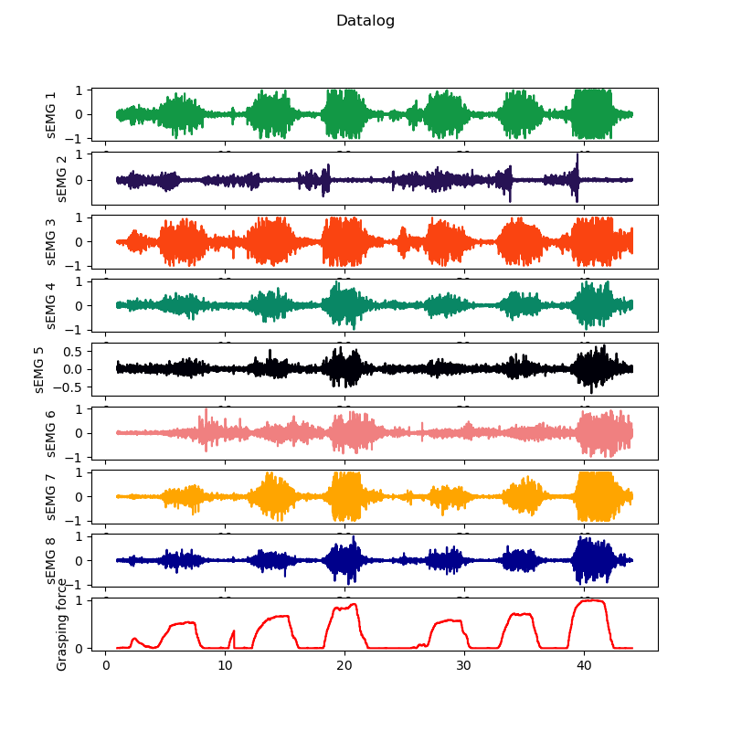

# This repositore contains the grasping force and EMG signals.

## The system used for datalog and real-time visualization is shown next Fig:

## The MYO armband (Thalmic Labs, Kitchener-Waterloo, Canada) was used to record sEMG signals from the upper limb. The MYO has eight sEMG input channels, wireless communication via Bluetooth protocol, sampling rate of 200 Hz and 8-bit resolution. Also, a force-sensitive-resistor (FSR) (Model 402, Interlink Electronics, Inc.) was used for force measurement with sensitivity from 1N to 50N. The FSR was inserted in an anti-stress ball and its inputs were fed into an Arduino-based data-acquisition (Daq) device, with a 10-bit analog-to-digital resolution. The datalog devices communicate with a Windows PC running Python for real-time visualization and data storage.

## The experimental procedures were approved by the local ethics committee of the Federal University of Pará (82131517.1.0000.0018). A total of 10 healthy voluntaries (four females and six males, with 24 $\pm$ 4 years old) were selected for the grasping force estimation study and signed an informed consent. The MYO device was placed in the same forearm location for each subject. Channel 4 was used as reference and was positioned in the extensor digitorum muscle, as shown in next Fig:

## The location of superficial electrodes over forearm muscles is detailed in Table 1.

### Table 1
Number | Muscle name 
--- | --- |
(1) | Pronator Teres | 
(2) | Brachioradialis | 
(3) | Extensor Carpi Radialis | 
(4) | Extensor Digitorum Cummunis | 
(5) | Exstensor Carpi Ulnaris | 
(6) | Flexor Carpi Ulnaris  | 
(7) | Palmaris Longus  | 
(8) | Flexor Carpi Radiallis  | 

## At the beginning of the experiment, each participant received the following command: "Position the ball with the sensor facing the palm, then press the ball three times. The first time squeeze it with a small force, the second time with a medium  force, and the third time with the highest force. Pay attention to the commands to start and end the movement". The sEMG and the force exerted by each volunteer were simultaneously recorded within the 0-100 \% range of the maximum voluntary contraction (MVC), as shown in next Fig:  

