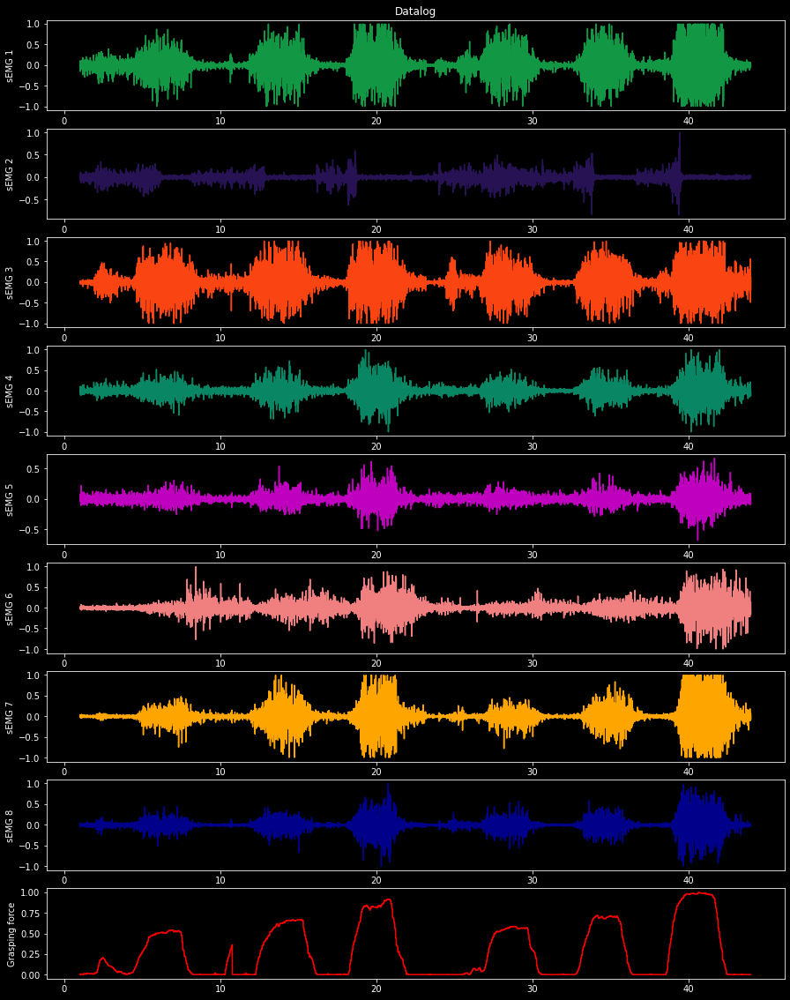

## Open EMG Data and Grasping Force signals

This code show how to open the  database of Emg signals and grasping force signal, disposable in extension " .m " in "EMG_force_datalog" path.

More details about record of signals, used protocol, used electromyography and experimental setup are presented in "EMG_force_datalog" folder
[Presented here](https://github.com/brunoodutra/My_Thesis/tree/main/EMG_Data_and_Force_signals/EMG_force_datalog)


### Import libraries


```python
import numpy as np
from numpy.linalg import inv
import matplotlib.pyplot as plt 
#import functions as func
import scipy.io
import seaborn as ns;
#import Ident as id
from sklearn.model_selection import cross_val_score
```

####  Read the datalog file that is in " .m " extension 


```python
mat = scipy.io.loadmat('EMG_force_datalog/recording_force_v1.mat')     
emg = mat['emg'];
force=  mat['Force'];
Ts= mat['Ts'];
```

#### Define th Signal EMG with the imput signal 


```python
u1=emg[:,0];
u2=emg[:,1];
u3=emg[:,2];
u4=emg[:,3];
u5=emg[:,4];
u6=emg[:,5];
u7=emg[:,6];
u8=emg[:,7];
```

#### Define the grasping force with the output signal 


```python
y=force;
y.shape=(-1,1)
nit=y.shape[0]
```

#### Sample time and recording time settings


```python
# sample time 
Ts=0.005
# datalog recording time 
t  =np.linspace(1, Ts*nit-Ts, nit)
```

### Plot the EMG and Force signals


```python
fig, axs = plt.subplots(9, 1, figsize=(8, 8))
fig.suptitle('Datalog')

axs[0].plot(t, u1, '#129845')
axs[0].set_ylabel('sEMG 1')
axs[0].set_xlabel('Time(s)')

axs[1].plot(t, u2, '#271254')
axs[1].set_ylabel('sEMG 2')

axs[2].plot(t, u3, '#FA4411')
axs[2].set_ylabel('sEMG 3')

axs[3].plot(t, u4, '#098765')
axs[3].set_ylabel('sEMG 4')

axs[4].plot(t, u5, '#000009')
axs[4].set_ylabel('sEMG 5')

axs[5].plot(t, u6, 'lightcoral')
axs[5].set_ylabel('sEMG 6')

axs[6].plot(t, u7, 'orange')
axs[6].set_ylabel('sEMG 7')

axs[7].plot(t, u8, 'darkblue')
axs[7].set_ylabel('sEMG 8')

axs[8].plot(t, y, 'red')
axs[8].set_ylabel('Grasping force')


plt.show()
```
    
<p align="center">

</p>
