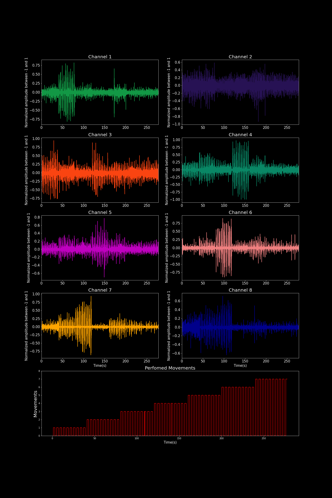

## EMG Data and Pattners Moviments

This code show how to open the database of Emg signals and pattners moviments, disposable in extension " .m " in "EMG_patterns_datalog" path.

More details about record of signals, used protocol, used electromyography and experimental setup are presented in "EMG_patterns_datalog" folder
[Presented here](https://github.com/brunoodutra/My_Thesis/tree/main/EMG_Data_and_pattners_moviments/EMG_pattners_datalog

### Import libraries

```python
import numpy as np
from numpy.linalg import inv
import matplotlib.pyplot as plt 
#import functions as func
import scipy.io
import seaborn as ns;
#import Ident as id
from sklearn.model_selection import cross_val_score
```

### Open libraries 

```python
import numpy as np
from numpy.linalg import inv
import matplotlib.pyplot as plt 
import scipy.optimize as opt
import scipy.io
import seaborn as ns;

# read the datalog that is in " .m " file 
```python
mat = scipy.io.loadmat('EMG_patterns_datalog/recording_mov_v2.mat')     
```
### define emg data
```python
emg = mat['emg'];
```
### define pattern moviments
```python
stimulus= mat['stimulus'];
```
### datalog recording time 
```python
Ts=0.05

nit=len(stimulus)
#ts= mat['Ts'];
t  =np.linspace(1, Ts*nit-Ts, nit)
```
### define th Signal EMG with the imput signal 
```python
u1=emg[:,0];
u2=emg[:,1];
u3=emg[:,2];
u4=emg[:,3];
u5=emg[:,4];
u6=emg[:,5];
u7=emg[:,6];
u8=emg[:,7];
```
#Define the labels of pattern moviments
```python
y=stimulus;
```
### plot the EMG and Force  signals    
```python
fig, axs = plt.subplots(9, 1, figsize=(8, 8))
fig.suptitle('Datalog')

axs[0].plot(t, u1, '#129845')
axs[0].set_ylabel('sEMG 1')
axs[0].set_xlabel('Time(s)')

axs[1].plot(t, u2, '#271254')
axs[1].set_ylabel('sEMG 2')

axs[2].plot(t, u3, '#FA4411')
axs[2].set_ylabel('sEMG 3')

axs[3].plot(t, u4, '#098765')
axs[3].set_ylabel('sEMG 4')

axs[4].plot(t, u5, '#000009')
axs[4].set_ylabel('sEMG 5')

axs[5].plot(t, u6, 'lightcoral')
axs[5].set_ylabel('sEMG 6')

axs[6].plot(t, u7, 'orange')
axs[6].set_ylabel('sEMG 7')

axs[7].plot(t, u8, 'darkblue')
axs[7].set_ylabel('sEMG 8')

axs[8].plot(t, y, 'red')
axs[8].set_ylabel('Moviments')


plt.show()
```
<p align="center">

</p>
